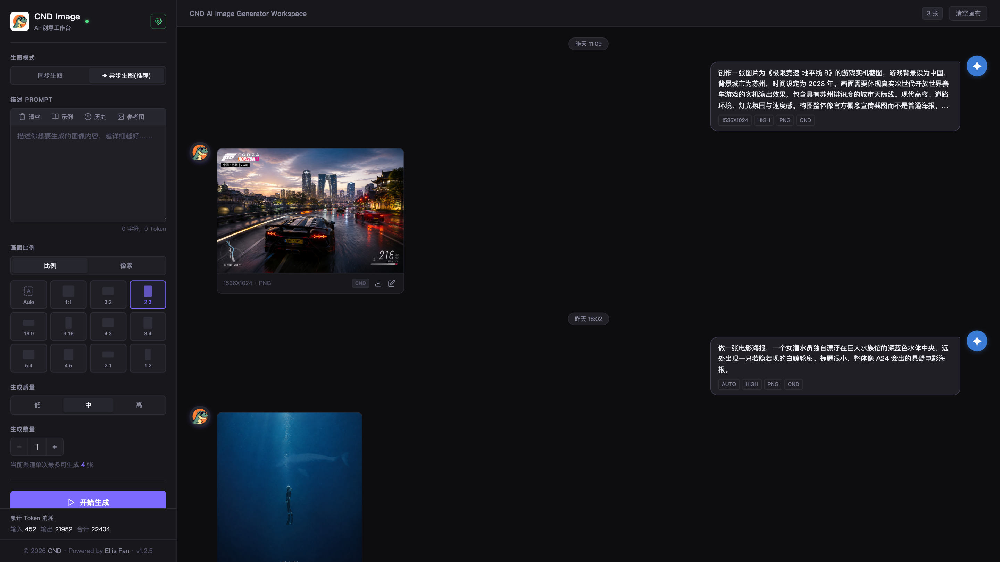
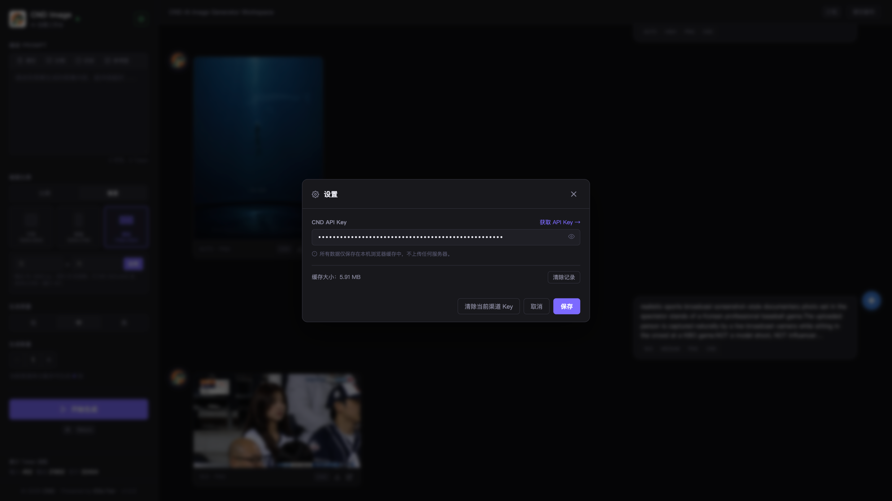
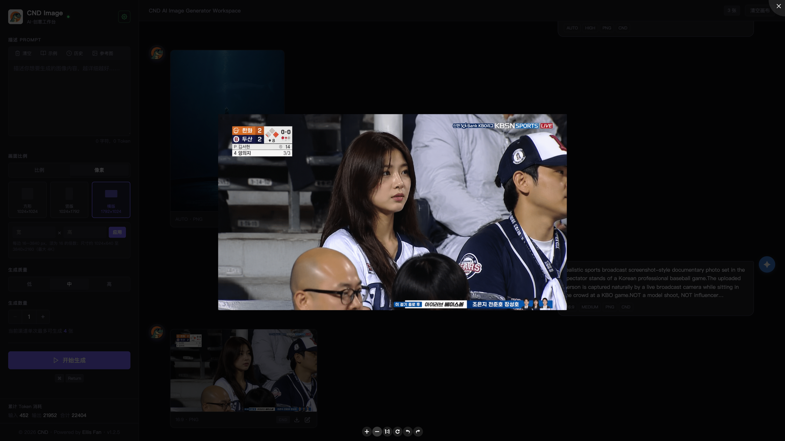
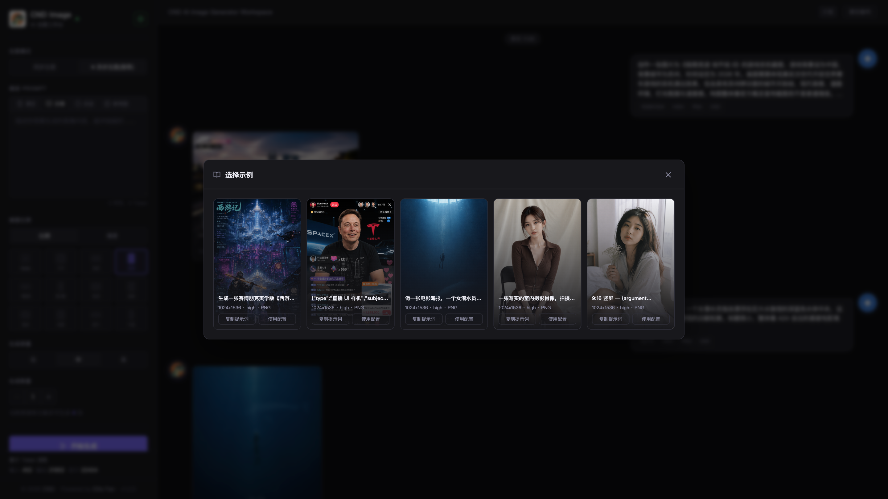
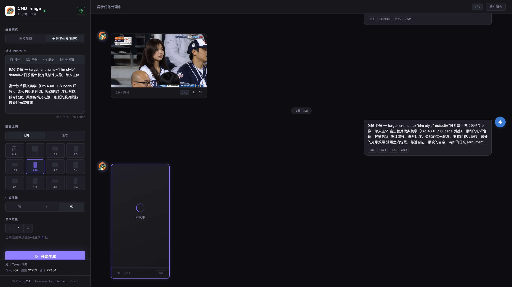

# CND Image

为了方便自己偶尔有需求的时候生点图，用Claude Code糊了一套WebUI出来。

基于第三方API的 GPT Image 2 图像生成工作台。对话式画布布局，所有记录本地存储，无需后端数据库。

**在线演示：[cnd.cool](https://cnd.cool)**

---

## 截图











---

## 功能

- **异步生图**（推荐）：提交后立即返回，后台轮询结果，不阻塞页面操作，单次最多 4 张，支持多张参考图
- **同步生图**：等待接口直接返回结果，单次最多 10 张，支持指定输出格式（PNG / JPEG / WEBP）与压缩质量
- **参考图**：可上传图片作为风格参考或改图依据，最大 5 MB
- **灵活尺寸**：12 种比例预设（含 Auto）、像素模式预设，以及完全自定义宽高（16–3840px，需被 16 整除）
- **对话画布**：Prompt 与生成结果以左右分栏的对话流呈现，新消息自动滚入视野
- **本地历史**：记录与图片资产全部存储于 IndexedDB，刷新页面不丢失，支持历史浏览与一键复用
- **大图预览**：点击图片进入 Lightbox，支持缩放与翻页
- **用量统计**：页脚实时显示累计 input / output / total token 消耗

---

## 使用

1. 打开 [cnd.cool](https://cnd.cool)，或将本项目部署到自己的服务器
2. 点击右上角「设置」，填入 [CND API Key](https://api.cnd.cool/register?aff=O3iX)
3. 在左侧选择生图模式（异步 / 同步）、画面比例、生成数量，输入 Prompt，点击「开始生成」
4. 生成完成后点击图片可放大预览，点击「选择示例」可浏览历史并复用 Prompt
5. 可通过修改`assets/js/config.js`中`endpoint`、`asyncEndpoint`和`asyncPollBase`来切换同步、异步的接口请求地址

---

## 部署

无构建步骤，纯静态 JS（原生 ES Module）+ 最小化 PHP 入口，复制到 Web 根目录即可运行。

```
index.html      # 入口页面
upload.php      # 参考图上传接口（可替换为任意文件上传服务）
assets/
  js/           # 模块化 JS，无需打包
  css/
release.json    # 版本更新说明
```

PHP 仅承担页面渲染与参考图中转，无数据库依赖。如需替换上传后端，修改 `app.js` 中 `uploadRefImage` 函数指向新接口即可，前端与上传服务完全解耦。

---

## License

MIT
